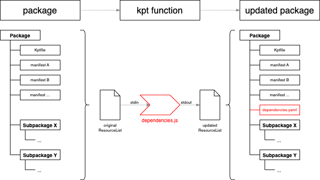
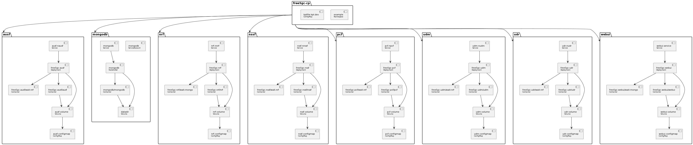

# DependencyGraph

Proof of Concept kpt function to derive dependency information from packages.

This information supports determining the impact of issues and/or the root cause of user problems.

The function is implemented in Node following the [specification](https://github.com/kubernetes-sigs/kustomize/blob/master/cmd/config/docs/api-conventions/functions-spec.md) for KRM functions.

## Concept

The kpt function (dependenies.js) parses all resources of the list of resources and calculates the corresponding dependency information. This information is added as a "dependencies.yaml" custom resource to the list of resources.




The custom resource (dependencies.yaml) with the dependency information has following schema:

<pre>
<b>apiVersion:</b> experimental.nephio.org/v1alpha1
<b>kind:</b> DependencyGraph
<b>metadata:</b>
    ...
<b>spec:</b>
    resources:
        - path:  [resource annotation: internal.config.kubernetes.io/path]
          index: [resource annotation: internal.config.kubernetes.io/index]
          gvk:   [group/version/kind of resource]
          name:  [name of resource]
          ...
          dependencies:
              - gvk:  [group/version/kind of dependency]
                name: [name of dependency]
                ...
              - ...
        - ...
</pre>

It contains a list of resources identified by their group, version, kind and name. Each resource may have a list of dependencies which may also be identified by their corresponding group, version, kind and name.

This information allows to create a dependency graph for the different resources of a package which supports impact analysis and root-cause analysis.

## Demonstration

This demonstration will show how the kpt function derives dependency information from a set of packages. The directory "data/free5gc-cp" contains for this purpose a package directory with a set of network functions for the [free 5GC control plane](https://github.com/nephio-project/free5gc-packages) from the Nephio project.


<b>Prerequisites</b>

The following prerequisites need to be met:

- [node](https://nodejs.org/en/download): node javascript programming language
- [kpt](https://kpt.dev/installation/): konfiguration management tool
- [yq](https://mikefarah.gitbook.io/yq/): yaml processor

<b>Steps</b>

- clone this repository and change into the root directory
- initialise the project via ```npm init```
- invoke the script: ```./demo.sh```

The script simulates following steps and generates files to capture the intermediate results:

a) Convert package information into a ResourceList object: _test-1.yaml_
b) Apply kpt function and generate an updated ResourceList object: _test-2.yaml_
c) Extract the DepedendencyGraph custom resource: _test-3.yaml_
d) Convert the DependencyGraph customer resource to plantuml: _test-4.puml_

The file _test-4.puml_ can then be visulized via a PlantUML online server, e.g.: www.plantuml.com 

The result can be seen here:



---

License: Apache-2.0
Author: bernard@tsai.eu
